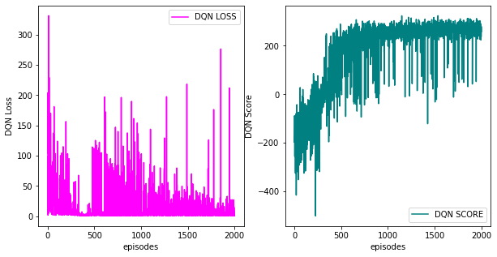

# Deep Q-Network (DQN) and Variants
## Overview
This repository contains the implementation of Deep Q-Network (DQN) and its variants: Duelling DQN and Duelling DDQN. The code is structured to run the models on a specific environment, track their performance over episodes, and visualize the results.

## Repository Structure
- **dqn.py**: This is the main script that contains the implementation of the DQN algorithm along with its variants.
- **DQN.png** : Contains plots for DQN training including the loss and score over episodes.
- **Duelling DQN.png** : Contains plots for Duelling DQN training including the loss and score over episodes.
- **duelling ddqn.png** : Contains plots for Duelling DDQN training including the loss and score over episodes.

## Models

### 1. **Deep Q-Network (DQN)**

The DQN model is a reinforcement learning algorithm where a neural network is used to approximate the Q-value function. This repository provides an implementation of the DQN algorithm along with visualizations of the training process.

#### DQN Loss and Score

- **Loss**: The DQN loss graph shows the fluctuations in loss over episodes. Despite the high variance in loss initially, the overall trend indicates that the loss decreases as the agent learns.
- **Score**: The score graph shows the cumulative reward obtained by the agent over episodes. The agent's performance improves significantly after the initial exploration phase.



### 2. **Duelling DQN**

The Duelling DQN architecture improves upon the DQN by estimating the state value and advantage separately. This helps in stabilizing the training process and achieving better performance.

#### Duelling DQN Loss and Score

- **Loss**: The loss for Duelling DQN shows similar high variance but generally decreases over time, indicating learning and adaptation.
- **Score**: The performance (score) improves steadily, reaching higher scores faster compared to the standard DQN.


### 3. **Duelling DDQN**

The Duelling DDQN combines the Duelling architecture with Double DQN, which mitigates the overestimation bias present in Q-learning.

#### Duelling DDQN Loss and Score

- **Loss**: The loss graph for Duelling DDQN exhibits fluctuations similar to the other models but with some stability after initial training.
- **Score**: The score graph shows improved performance with more stable and higher scores compared to the DQN and Duelling DQN.


## Results

The figures show that both the Duelling DQN and Duelling DDQN architectures generally perform better than the standard DQN in terms of stability and score. The Duelling DDQN in particular demonstrates robust performance with the highest and most stable scores over the episodes.

## How to Run

1. Clone the repository.
2. Ensure you have all the required dependencies installed.
3. Run the script using:
   ```bash
   python dqn.py
